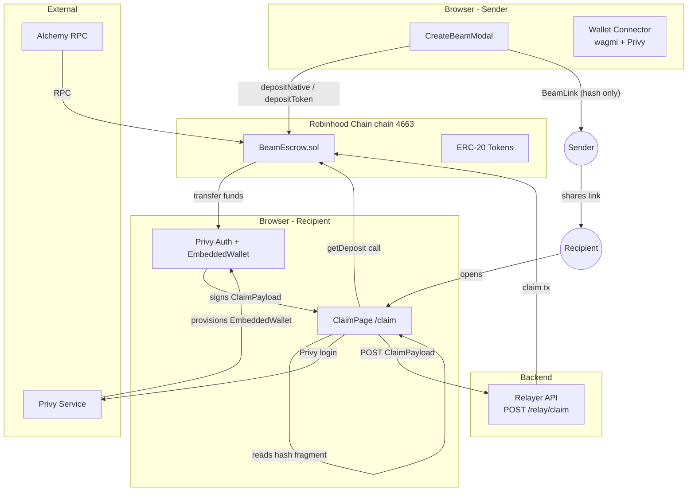
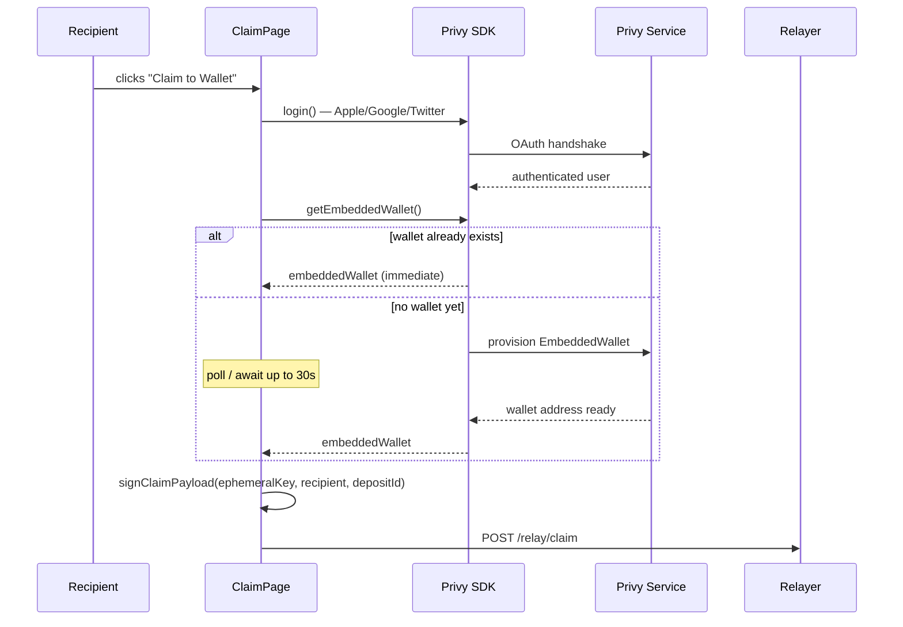

# Design Document: Beam

## Overview

Beam is a Web3 "send-by-link" application on Robinhood Chain (Arbitrum Orbit L2, chain ID 4663). A Sender deposits ETH or any ERC-20 token into an on-chain escrow contract, receives a shareable URL whose hash fragment encodes an ephemeral private key, and shares the link via any messaging channel. A Recipient opens the link, authenticates with a social account through Privy, and claims the funds gaslessly — no prior wallet, no gas funds required.

The system consists of four cooperating components:

1. **BeamEscrow** — a Solidity smart contract that holds funds and enforces claim/cancel rules
2. **Next.js Frontend** — the CreateBeamModal (sender flow) and ClaimPage (recipient flow)
3. **Relayer** — a lightweight backend that submits claim transactions on the Recipient's behalf, paying gas
4. **Privy** — external authentication and embedded-wallet provisioning service

Key security property: the EphemeralKey lives exclusively in the URL hash fragment. It never touches a server, never appears in HTTP logs, and is used once then discarded.

---

## Architecture

### System Overview



### Data Flow: Send

```
Sender connects wallet
  → CreateBeamModal opens
  → generatePrivateKey() → ephemeralPrivKey (in memory only)
  → deriveAddress(ephemeralPrivKey) → claimSignerAddress
  → [ERC-20 path] approve(BeamEscrow, amount)
  → depositNative(claimSignerAddress) {value: amount}
     OR depositToken(token, amount, claimSignerAddress)
  → tx confirmed → depositId returned
  → buildBeamLink(origin, ephemeralPrivKey, depositId) → BeamLink
  → display BeamLink with copy + share buttons
  → ephemeralPrivKey remains in JS memory until page unload
```

### Data Flow: Claim

```
Recipient opens BeamLink
  → ClaimPage mounts
  → parseHashFragment(location.hash) → { ephemeralPrivKey, depositId }
  → getDeposit(depositId) → { sender, token, amount, claimed }
  → display deposit metadata
  → Recipient clicks "Claim to Wallet"
  → Privy.login() → social auth (Apple/Google/Twitter)
  → await embeddedWallet (up to 30s)
  → recipientAddress = embeddedWallet.address
  → msg = keccak256(abi.encodePacked(recipientAddress, depositId))
  → signature = eip191Sign(ephemeralPrivKey, msg)
  → POST /relay/claim { depositId, recipientAddress, signature }
  → Relayer submits claim(depositId, recipientAddress, signature)
  → tx confirmed → success state + confetti
```

---

## Components and Interfaces

### Smart Contract Layer

```
BeamEscrow.sol
├── depositNative(claimSignerAddress) payable → depositId
├── depositToken(token, amount, claimSignerAddress) → depositId
├── claim(depositId, recipientAddress, signature) nonReentrant
├── cancel(depositId) nonReentrant
├── getDeposit(depositId) view → Deposit
└── Events: Deposited, Claimed, Cancelled
```

### Frontend Component Tree

```
app/
├── layout.tsx                    # PrivyProvider + WagmiProvider root
├── page.tsx                      # LandingPage
│   ├── Navbar.tsx
│   ├── HeroSection.tsx
│   │   ├── StatsStrip.tsx
│   │   └── BeamPreviewCard.tsx
│   ├── HowItWorksSection.tsx
│   ├── WhyBeamSection.tsx
│   ├── FAQSection.tsx
│   └── BottomCTA.tsx
└── claim/
    └── page.tsx                  # ClaimPage (client component)
        ├── DepositCard.tsx
        ├── ClaimButton.tsx
        └── ClaimSuccess.tsx      # confetti + success state

components/
├── CreateBeamModal.tsx           # multi-step send flow
│   ├── AssetSelector.tsx
│   ├── AmountInput.tsx
│   ├── FeeEstimate.tsx
│   ├── StepIndicator.tsx
│   └── BeamLinkDisplay.tsx
├── ui/
│   ├── Button.tsx
│   ├── Modal.tsx
│   ├── Badge.tsx
│   └── Accordion.tsx
└── providers/
    ├── PrivyProviderWrapper.tsx
    └── WagmiProviderWrapper.tsx

lib/
├── beam-link.ts                  # encode / parse BeamLink
├── eip191.ts                     # sign ClaimPayload
├── escrow.ts                     # contract read helpers
├── chains.ts                     # robinhoodChain viem definition
└── wagmi-config.ts               # wagmi + privy connector setup

hooks/
├── useBeamEscrow.ts              # typed contract hooks
├── useDeposit.ts                 # send flow orchestration
└── useClaim.ts                   # claim flow orchestration
```

### Relayer Service

```
POST /relay/claim
  Body: RelayClaimRequest
  Response: RelayClaimResponse

GET  /relay/health
  Response: { status: "ok" }
```

---

## Data Models

### On-Chain: Deposit Struct (Solidity)

```solidity
struct Deposit {
    address sender;          // address that created the deposit
    address token;           // address(0) for native ETH, ERC-20 address otherwise
    uint256 amount;          // token units (wei for ETH)
    address claimSigner;     // public address derived from EphemeralKey
    bool    claimed;         // true after claim() or cancel() succeeds
    uint256 createdAt;       // block.timestamp at deposit creation
}
```

Storage layout in `BeamEscrow`:

```solidity
mapping(uint256 => Deposit) private deposits;
uint256 private depositCounter;    // starts at 0, first valid ID is 1
```

### TypeScript Types

```typescript
// lib/types.ts

export interface Deposit {
  sender:      `0x${string}`;
  token:       `0x${string}`;   // address(0) = native ETH
  amount:      bigint;
  claimSigner: `0x${string}`;
  claimed:     boolean;
  createdAt:   bigint;          // Unix timestamp
}

export interface BeamLinkParams {
  ephemeralPrivKey: `0x${string}`;  // 32-byte hex, 64 chars
  depositId:        bigint;
}

export interface ClaimPayload {
  depositId:        bigint;
  recipientAddress: `0x${string}`;
  signature:        `0x${string}`;  // EIP-191 personal_sign
}

export interface RelayClaimRequest {
  depositId:        string;          // base-10 decimal string
  recipientAddress: `0x${string}`;
  signature:        `0x${string}`;
}

export interface RelayClaimResponse {
  txHash:  `0x${string}`;
  status:  'submitted' | 'confirmed' | 'failed';
  message?: string;
}

export type BeamStep =
  | 'idle'
  | 'approval-pending'
  | 'approval-confirming'
  | 'deposit-pending'
  | 'deposit-confirming'
  | 'link-generated';
```

### ABI Fragments (viem)

```typescript
// lib/escrow-abi.ts — minimal ABI fragments used by the frontend

export const BEAM_ESCROW_ABI = [
  // depositNative
  {
    name: 'depositNative',
    type: 'function',
    stateMutability: 'payable',
    inputs: [{ name: 'claimSignerAddress', type: 'address' }],
    outputs: [{ name: 'depositId', type: 'uint256' }],
  },
  // depositToken
  {
    name: 'depositToken',
    type: 'function',
    stateMutability: 'nonpayable',
    inputs: [
      { name: 'tokenAddress', type: 'address' },
      { name: 'amount', type: 'uint256' },
      { name: 'claimSignerAddress', type: 'address' },
    ],
    outputs: [{ name: 'depositId', type: 'uint256' }],
  },
  // getDeposit
  {
    name: 'getDeposit',
    type: 'function',
    stateMutability: 'view',
    inputs: [{ name: 'depositId', type: 'uint256' }],
    outputs: [
      {
        name: '',
        type: 'tuple',
        components: [
          { name: 'sender',      type: 'address' },
          { name: 'token',       type: 'address' },
          { name: 'amount',      type: 'uint256' },
          { name: 'claimSigner', type: 'address' },
          { name: 'claimed',     type: 'bool'    },
          { name: 'createdAt',   type: 'uint256' },
        ],
      },
    ],
  },
  // cancel
  {
    name: 'cancel',
    type: 'function',
    stateMutability: 'nonpayable',
    inputs: [{ name: 'depositId', type: 'uint256' }],
    outputs: [],
  },
  // Events
  {
    name: 'Deposited',
    type: 'event',
    inputs: [
      { name: 'depositId',          type: 'uint256', indexed: true  },
      { name: 'sender',             type: 'address', indexed: true  },
      { name: 'token',              type: 'address', indexed: false },
      { name: 'amount',             type: 'uint256', indexed: false },
      { name: 'claimSignerAddress', type: 'address', indexed: false },
    ],
  },
  {
    name: 'Claimed',
    type: 'event',
    inputs: [
      { name: 'depositId',       type: 'uint256', indexed: true  },
      { name: 'recipientAddress',type: 'address', indexed: true  },
      { name: 'token',           type: 'address', indexed: false },
      { name: 'amount',          type: 'uint256', indexed: false },
    ],
  },
  {
    name: 'Cancelled',
    type: 'event',
    inputs: [
      { name: 'depositId', type: 'uint256', indexed: true },
      { name: 'sender',    type: 'address', indexed: true },
    ],
  },
] as const;
```

---

## Smart Contract Design

### BeamEscrow.sol — Full Structure

```solidity
// SPDX-License-Identifier: MIT
pragma solidity 0.8.20;

import "@openzeppelin/contracts/utils/cryptography/ECDSA.sol";
import "@openzeppelin/contracts/utils/cryptography/MessageHashUtils.sol";
import "@openzeppelin/contracts/utils/ReentrancyGuard.sol";

contract BeamEscrow is ReentrancyGuard {
    using ECDSA for bytes32;

    // ─── Storage ────────────────────────────────────────────────
    struct Deposit {
        address sender;
        address token;       // address(0) = native ETH
        uint256 amount;
        address claimSigner;
        bool    claimed;
        uint256 createdAt;
    }

    mapping(uint256 => Deposit) private deposits;
    uint256 private depositCounter;

    // ─── Events ─────────────────────────────────────────────────
    event Deposited(
        uint256 indexed depositId,
        address indexed sender,
        address token,
        uint256 amount,
        address claimSignerAddress
    );

    event Claimed(
        uint256 indexed depositId,
        address indexed recipientAddress,
        address token,
        uint256 amount
    );

    event Cancelled(
        uint256 indexed depositId,
        address indexed sender
    );

    // ─── Custom Errors ───────────────────────────────────────────
    error ZeroValue();
    error ZeroAddress(string param);
    error DepositDoesNotExist(uint256 depositId);
    error AlreadyClaimed(uint256 depositId);
    error NotSender(uint256 depositId);
    error InvalidSignature();
    error TokenTransferFailed();
    error ETHTransferFailed();
    error ZeroAmount();

    // ─── External Functions ──────────────────────────────────────

    /**
     * @notice Deposit native ETH. Returns a unique depositId.
     * @param claimSignerAddress Public address derived from the EphemeralKey.
     */
    function depositNative(address claimSignerAddress)
        external
        payable
        returns (uint256 depositId)
    {
        if (msg.value == 0) revert ZeroValue();
        if (claimSignerAddress == address(0)) revert ZeroAddress("claimSignerAddress");

        depositId = ++depositCounter;
        deposits[depositId] = Deposit({
            sender:      msg.sender,
            token:       address(0),
            amount:      msg.value,
            claimSigner: claimSignerAddress,
            claimed:     false,
            createdAt:   block.timestamp
        });

        emit Deposited(depositId, msg.sender, address(0), msg.value, claimSignerAddress);
    }

    /**
     * @notice Deposit ERC-20 tokens. Caller must approve BeamEscrow first.
     */
    function depositToken(
        address tokenAddress,
        uint256 amount,
        address claimSignerAddress
    )
        external
        returns (uint256 depositId)
    {
        if (amount == 0) revert ZeroAmount();
        if (tokenAddress == address(0)) revert ZeroAddress("tokenAddress");
        if (claimSignerAddress == address(0)) revert ZeroAddress("claimSignerAddress");

        // Checks-Effects-Interactions: record first, then pull tokens
        depositId = ++depositCounter;
        deposits[depositId] = Deposit({
            sender:      msg.sender,
            token:       tokenAddress,
            amount:      amount,
            claimSigner: claimSignerAddress,
            claimed:     false,
            createdAt:   block.timestamp
        });

        // safeTransferFrom via low-level call to handle non-standard ERC-20
        (bool ok, bytes memory data) = tokenAddress.call(
            abi.encodeWithSignature(
                "transferFrom(address,address,uint256)",
                msg.sender, address(this), amount
            )
        );
        if (!ok || (data.length > 0 && !abi.decode(data, (bool)))) {
            // Rollback state (CEI violation would occur if we did this after,
            // so we revert unconditionally — no partial state escapes)
            revert TokenTransferFailed();
        }

        emit Deposited(depositId, msg.sender, tokenAddress, amount, claimSignerAddress);
    }

    /**
     * @notice Claim funds using the ephemeral key signature.
     * @param depositId    The deposit to claim.
     * @param recipientAddress Where to send the funds.
     * @param signature    EIP-191 personal_sign over keccak256(abi.encodePacked(recipientAddress, depositId)).
     */
    function claim(
        uint256 depositId,
        address recipientAddress,
        bytes calldata signature
    )
        external
        nonReentrant
    {
        Deposit storage dep = deposits[depositId];

        // ── Checks ───────────────────────────────────────────────
        if (dep.amount == 0 && !dep.claimed) revert DepositDoesNotExist(depositId);
        if (dep.claimed) revert AlreadyClaimed(depositId);
        if (recipientAddress == address(0)) revert ZeroAddress("recipientAddress");

        bytes32 msgHash = keccak256(abi.encodePacked(recipientAddress, depositId));
        bytes32 ethHash = MessageHashUtils.toEthSignedMessageHash(msgHash);
        address recovered = ethHash.recover(signature);
        if (recovered == address(0) || recovered != dep.claimSigner) revert InvalidSignature();

        // ── Effects ───────────────────────────────────────────────
        dep.claimed = true;
        address token  = dep.token;
        uint256 amount = dep.amount;

        // ── Interactions ──────────────────────────────────────────
        if (token == address(0)) {
            (bool ok,) = recipientAddress.call{value: amount}("");
            if (!ok) revert ETHTransferFailed();
        } else {
            (bool ok, bytes memory data) = token.call(
                abi.encodeWithSignature("transfer(address,uint256)", recipientAddress, amount)
            );
            if (!ok || (data.length > 0 && !abi.decode(data, (bool)))) revert TokenTransferFailed();
        }

        emit Claimed(depositId, recipientAddress, token, amount);
    }

    /**
     * @notice Cancel an unclaimed deposit and recover funds.
     * Only the original sender may cancel.
     */
    function cancel(uint256 depositId)
        external
        nonReentrant
    {
        Deposit storage dep = deposits[depositId];

        // ── Checks ───────────────────────────────────────────────
        if (dep.amount == 0 && !dep.claimed) revert DepositDoesNotExist(depositId);
        if (dep.claimed) revert AlreadyClaimed(depositId);
        if (dep.sender != msg.sender) revert NotSender(depositId);

        // ── Effects ───────────────────────────────────────────────
        dep.claimed = true;
        address token  = dep.token;
        uint256 amount = dep.amount;
        address sender = dep.sender;

        // ── Interactions ──────────────────────────────────────────
        if (token == address(0)) {
            (bool ok,) = sender.call{value: amount}("");
            if (!ok) revert ETHTransferFailed();
        } else {
            (bool ok, bytes memory data) = token.call(
                abi.encodeWithSignature("transfer(address,uint256)", sender, amount)
            );
            if (!ok || (data.length > 0 && !abi.decode(data, (bool)))) revert TokenTransferFailed();
        }

        emit Cancelled(depositId, sender);
    }

    /**
     * @notice Read a Deposit record by ID.
     */
    function getDeposit(uint256 depositId)
        external
        view
        returns (Deposit memory)
    {
        return deposits[depositId];
    }
}
```

### CEI Pattern Enforcement

Both `claim` and `cancel` follow Checks-Effects-Interactions strictly:

1. **Checks** — validate all preconditions (existence, claimed status, authorization, signature)
2. **Effects** — set `dep.claimed = true` and cache values into local stack variables before any external call
3. **Interactions** — execute ETH transfer or ERC-20 `transfer` using cached values

This means even if a reentrant call is made during the interaction phase, `dep.claimed` is already `true` and the reentrant call will revert at the Checks phase. `nonReentrant` provides a second layer of protection.

### Deposit Existence Check

A deposit "exists" when at least one of these is true:
- `dep.amount > 0`
- `dep.claimed == true` (covers cancelled/claimed deposits that had their amount set)

The check `dep.amount == 0 && !dep.claimed` catches IDs that were never populated.

---

## Key Algorithms

### Ephemeral Key Generation

```typescript
// lib/beam-link.ts
import { generatePrivateKey, privateKeyToAddress } from 'viem/accounts';

export function generateEphemeralKey(): {
  ephemeralPrivKey: `0x${string}`;
  claimSignerAddress: `0x${string}`;
} {
  const ephemeralPrivKey = generatePrivateKey();   // 32 random bytes, hex-encoded
  const claimSignerAddress = privateKeyToAddress(ephemeralPrivKey);
  return { ephemeralPrivKey, claimSignerAddress };
}
```

The key is generated inside `CreateBeamModal` immediately before the deposit transaction is submitted. It is stored only in React component state (never persisted to localStorage, sessionStorage, or transmitted over network).

### BeamLink Construction

```typescript
// lib/beam-link.ts

/**
 * Encode an ephemeral private key as a 64-char lowercase hex string
 * (zero-padded to 32 bytes) and depositId as base-10 decimal.
 * Produces: {origin}/claim#key=<64hexchars>&id=<decimal>
 */
export function constructBeamLink(
  origin: string,
  ephemeralPrivKey: `0x${string}`,
  depositId: bigint,
): string {
  // Strip 0x prefix, zero-pad to 64 hex chars (32 bytes)
  const hexKey = ephemeralPrivKey.slice(2).toLowerCase().padStart(64, '0');
  const decId  = depositId.toString(10);
  return `${origin}/claim#key=${hexKey}&id=${decId}`;
}
```

### BeamLink Parsing

```typescript
// lib/beam-link.ts

const VALID_KEY_RE = /^[0-9a-f]{64}$/;
const VALID_ID_RE  = /^(0|[1-9]\d*)$/;

export interface ParsedBeamLink {
  ephemeralPrivKey: `0x${string}`;
  depositId: bigint;
}

export function parseBeamLink(hash: string): ParsedBeamLink {
  const params = new URLSearchParams(hash.replace(/^#/, ''));
  const rawKey = params.get('key') ?? '';
  const rawId  = params.get('id')  ?? '';

  if (!VALID_KEY_RE.test(rawKey)) {
    throw new Error('Invalid or missing key parameter');
  }
  if (!VALID_ID_RE.test(rawId)) {
    throw new Error('Invalid or missing id parameter');
  }

  return {
    ephemeralPrivKey: `0x${rawKey}`,
    depositId: BigInt(rawId),
  };
}
```

### EIP-191 ClaimPayload Signing

```typescript
// lib/eip191.ts
import { keccak256, encodePacked, toBytes } from 'viem';
import { privateKeyToAccount } from 'viem/accounts';

/**
 * Sign the ClaimPayload: EIP-191 personal_sign over
 * keccak256(abi.encodePacked(recipientAddress, depositId))
 */
export async function signClaimPayload(
  ephemeralPrivKey: `0x${string}`,
  recipientAddress: `0x${string}`,
  depositId: bigint,
): Promise<`0x${string}`> {
  const msgHash = keccak256(
    encodePacked(['address', 'uint256'], [recipientAddress, depositId])
  );
  const account = privateKeyToAccount(ephemeralPrivKey);
  // signMessage applies EIP-191 prefix: "\x19Ethereum Signed Message:\n32"
  return account.signMessage({ message: { raw: toBytes(msgHash) } });
}
```

The contract uses `MessageHashUtils.toEthSignedMessageHash` (OpenZeppelin) which applies the same EIP-191 prefix before calling `ECDSA.recover`, so the two sides are symmetric.

### Sender Address Formatting

```typescript
// lib/format.ts

export function truncateAddress(address: `0x${string}`): string {
  return `${address.slice(0, 6)}...${address.slice(-4)}`;
  // "0x1234...abcd"
}

export function formatTokenAmount(
  amount: bigint,
  decimals: number,
): string {
  const raw = (Number(amount) / 10 ** decimals).toFixed(decimals);
  return raw.replace(/\.?0+$/, '');   // remove trailing zeros
}
```

---

## Wagmi / Viem Configuration

### RobinhoodChain Definition

```typescript
// lib/chains.ts
import { defineChain } from 'viem';

export const robinhoodChain = defineChain({
  id: 4663,
  name: 'Robinhood Chain',
  nativeCurrency: { name: 'Ether', symbol: 'ETH', decimals: 18 },
  rpcUrls: {
    default: {
      http: [
        process.env.NEXT_PUBLIC_RPC_URL ??
        'https://rpc.mainnet.chain.robinhood.com',
      ],
    },
  },
  blockExplorers: {
    default: {
      name: 'Blockscout',
      url: 'https://robinhoodchain.blockscout.com',
    },
  },
});
```

### Wagmi + Privy Configuration

```typescript
// lib/wagmi-config.ts
import { createConfig, http } from 'wagmi';
import { toPrivyWagmiAdapter } from '@privy-io/wagmi';
import { robinhoodChain } from './chains';

// The PrivyProviderWrapper passes privyConfig to PrivyProvider;
// toPrivyWagmiAdapter bridges Privy's embedded wallet into wagmi.
export const wagmiConfig = createConfig({
  chains: [robinhoodChain],
  transports: {
    [robinhoodChain.id]: http(),
  },
  connectors: [
    toPrivyWagmiAdapter(),
  ],
});
```

### Contract Hooks

```typescript
// hooks/useBeamEscrow.ts
import {
  useReadContract,
  useWriteContract,
  useWaitForTransactionReceipt,
} from 'wagmi';
import { BEAM_ESCROW_ABI } from '@/lib/escrow-abi';
import { BEAM_ESCROW_ADDRESS } from '@/lib/constants';

export function useGetDeposit(depositId: bigint | undefined) {
  return useReadContract({
    address: BEAM_ESCROW_ADDRESS,
    abi: BEAM_ESCROW_ABI,
    functionName: 'getDeposit',
    args: depositId !== undefined ? [depositId] : undefined,
    query: { enabled: depositId !== undefined },
  });
}

export function useDepositNative() {
  const { writeContractAsync, data: hash } = useWriteContract();
  const receipt = useWaitForTransactionReceipt({ hash });

  const deposit = (claimSignerAddress: `0x${string}`, value: bigint) =>
    writeContractAsync({
      address: BEAM_ESCROW_ADDRESS,
      abi: BEAM_ESCROW_ABI,
      functionName: 'depositNative',
      args: [claimSignerAddress],
      value,
    });

  return { deposit, hash, receipt };
}

export function useDepositToken() {
  const { writeContractAsync, data: hash } = useWriteContract();
  const receipt = useWaitForTransactionReceipt({ hash });

  const deposit = (
    tokenAddress: `0x${string}`,
    amount: bigint,
    claimSignerAddress: `0x${string}`,
  ) =>
    writeContractAsync({
      address: BEAM_ESCROW_ADDRESS,
      abi: BEAM_ESCROW_ABI,
      functionName: 'depositToken',
      args: [tokenAddress, amount, claimSignerAddress],
    });

  return { deposit, hash, receipt };
}
```

---

## Privy Integration

### Provider Setup

```typescript
// components/providers/PrivyProviderWrapper.tsx
'use client';
import { PrivyProvider } from '@privy-io/react-auth';
import { WagmiProvider }  from '@privy-io/wagmi';
import { QueryClient, QueryClientProvider } from '@tanstack/react-query';
import { wagmiConfig } from '@/lib/wagmi-config';

const queryClient = new QueryClient();

const privyAppId = process.env.NEXT_PUBLIC_PRIVY_APP_ID;
if (!privyAppId) {
  throw new Error(
    'NEXT_PUBLIC_PRIVY_APP_ID environment variable is missing or empty'
  );
}

export function Providers({ children }: { children: React.ReactNode }) {
  return (
    <PrivyProvider
      appId={privyAppId}
      config={{
        loginMethods: ['apple', 'google', 'twitter'],
        embeddedWallets: {
          createOnLogin: 'users-without-wallets',
          noPromptOnSignature: false,
        },
        defaultChain: { id: 4663 } as any,
        supportedChains: [{ id: 4663 } as any],
      }}
    >
      <QueryClientProvider client={queryClient}>
        <WagmiProvider config={wagmiConfig}>
          {children}
        </WagmiProvider>
      </QueryClientProvider>
    </PrivyProvider>
  );
}
```

### Embedded Wallet Provisioning Flow



```typescript
// hooks/useClaim.ts  — wallet provisioning with 30s timeout

export async function waitForEmbeddedWallet(
  privy: ReturnType<typeof usePrivy>,
): Promise<`0x${string}`> {
  const TIMEOUT_MS = 30_000;
  const POLL_INTERVAL_MS = 500;

  const deadline = Date.now() + TIMEOUT_MS;
  while (Date.now() < deadline) {
    const wallet = privy.user?.linkedAccounts.find(
      (a) => a.type === 'wallet' && a.walletClientType === 'privy'
    );
    if (wallet) return wallet.address as `0x${string}`;
    await new Promise((r) => setTimeout(r, POLL_INTERVAL_MS));
  }
  throw new Error('Wallet provisioning timed out after 30 seconds');
}
```

---

## Relayer Design

The Relayer is a stateless Node.js service. It holds a funded EOA ("relayer wallet") and submits claim transactions on behalf of Recipients, paying gas.

### API Contract

#### `POST /relay/claim`

**Request body:**

```typescript
{
  depositId:        string;          // base-10 decimal, e.g. "42"
  recipientAddress: `0x${string}`;   // checksummed EVM address
  signature:        `0x${string}`;   // EIP-191 bytes, 65 bytes hex
}
```

**Success response (200):**

```typescript
{
  txHash: `0x${string}`;
  status: 'submitted';
}
```

**Error response (4xx / 5xx):**

```typescript
{
  error: string;     // human-readable reason
  code:  string;     // machine-readable: "ALREADY_CLAIMED" | "INVALID_SIG" | "RELAY_FAILED" | ...
}
```

### Relayer Internal Flow

```
1. Validate request fields (depositId is valid decimal, address checksums, sig length)
2. Call getDeposit(depositId) — reject if claimed=true (ALREADY_CLAIMED)
3. Dry-run claim() via eth_call — reject if it would revert (INVALID_SIG or other)
4. Submit claim(depositId, recipientAddress, signature) with gas limit = estimate * 1.2
5. Return txHash immediately (fire-and-forget; frontend polls tx status)
```

The Relayer does **not** persist any state. It does not store ephemeral keys. All it receives is the already-computed signature.

### Security Considerations for the Relayer

- Rate limiting per IP: max 5 relay requests per minute
- The relayer wallet address is public; it should hold only enough ETH for gas
- The Relayer cannot steal funds — it submits `claim()` specifying a `recipientAddress` supplied by the caller. The on-chain signature verification ensures only the rightful recipient can authorize a valid signature for their address
- A malicious Relayer could refuse to relay (DoS), but cannot redirect funds to a different address without a valid signature

---

## Security Design

### Key Isolation Guarantees

| Threat | Mitigation |
|---|---|
| Server sees EphemeralKey | Key lives in URL hash (`#...`). Hash fragment is never sent in HTTP requests by browsers. |
| Analytics / logging captures key | Key is in hash fragment, excluded from server logs and most analytics SDKs. Design doc mandates no server-side logging of raw key. |
| XSS reads key from JS | Standard CSP headers; key removed from memory after claim/failure. |
| Key reuse | Each deposit uses a fresh `generatePrivateKey()` call. Reusing a key requires reusing the deposit — the contract enforces `claimed=false` before allowing a claim. |
| Signature replay on another deposit | ClaimPayload includes `depositId`. A signature valid for deposit #7 is invalid for deposit #8. |
| Signature replay for a different recipient | ClaimPayload includes `recipientAddress`. A signature for Alice's address is invalid if Bob's address is supplied. |

### Replay Protection

The ClaimPayload is: `keccak256(abi.encodePacked(recipientAddress, depositId))`

This binds the signature to:
- A specific recipient — prevents Relayer or MITM from redirecting to themselves
- A specific deposit — prevents cross-deposit replay

Once claimed, `dep.claimed = true` prevents any further claim. The EphemeralKey has no utility after the deposit is claimed.

### CEI Pattern

Both `claim` and `cancel` set `dep.claimed = true` (Effects) before executing any external call (Interactions). If the external call fails, the transaction reverts — but since Solidity reverts unwind all state changes, `claimed` is reset to its pre-call value. This is handled correctly by using `revert` on transfer failure, which rolls back the entire transaction including the `claimed = true` write.

### Integer Overflow

Solidity 0.8.20 has built-in overflow protection on all arithmetic operations. `depositCounter++` will revert at `type(uint256).max`, which is unreachable in practice.

---

## Error Handling

### Smart Contract

Custom errors (gas-efficient) cover all invalid state transitions:
- `ZeroValue()` — ETH deposit with msg.value == 0
- `ZeroAmount()` — ERC-20 deposit with amount == 0
- `ZeroAddress(string param)` — any address argument is address(0)
- `DepositDoesNotExist(uint256 depositId)` — depositId not in storage
- `AlreadyClaimed(uint256 depositId)` — deposit is in terminal state
- `NotSender(uint256 depositId)` — cancel caller ≠ deposit.sender
- `InvalidSignature()` — ECDSA recovery fails or wrong signer
- `TokenTransferFailed()` — ERC-20 transferFrom/transfer returns false or reverts
- `ETHTransferFailed()` — native ETH transfer fails

### Frontend Error States

| Scenario | UI Response |
|---|---|
| Gas estimation fails | Show "Fee estimation unavailable", disable confirm button |
| Deposit tx fails or no receipt in 60s | Discard ephemeral key, show error, return to deposit creation state |
| Hash fragment missing or malformed | Show "Invalid link" error, do not query contract |
| Contract query times out (>15s) | Show "Could not load deposit details" + retry button |
| Wallet provisioning times out (>30s) | Show "Wallet setup timed out" + retry button |
| Claim tx fails | Show error with reason + retry button (no re-authentication required) |
| Deposit already claimed | Show "Already claimed" message, hide claim button |
| `NEXT_PUBLIC_PRIVY_APP_ID` missing | Throw at module initialization, before rendering any UI |

---

## Testing Strategy

### Dual Testing Approach

Both unit tests (example-based) and property-based tests (PBT) are used:

- **Unit tests** verify specific behaviors, integration points, and error conditions with concrete inputs
- **Property-based tests** verify universal invariants that should hold across all valid inputs

The smart contract test suite uses **Foundry** with its built-in fuzzing engine. The TypeScript test suite uses **Vitest** for unit tests and **fast-check** for property-based tests.

Minimum iterations per property-based test: **100** (Foundry fuzzer default is 256 runs; fast-check default is 100 runs).

Each property test is tagged with a comment referencing its design property:
```
// Feature: beam, Property N: <property text>
```

### Unit Testing Guidelines

Unit tests cover:
- Specific happy-path examples for deposit, claim, cancel
- Error conditions: zero value, zero address, bad signature, already claimed, wrong sender
- UI component rendering: link display, step indicator progression, share button URLs
- Integration points: Privy auth hook, wagmi contract write callbacks
- Reentrancy attack test: mock reentrant ERC-20 contract attempts to re-enter `claim`

Avoid writing unit tests for behaviors already covered by property tests. Focus unit tests on deterministic concrete examples.

### Property-Based Test Configuration

**Solidity (Foundry):**
```toml
# foundry.toml
[fuzz]
runs = 256
```

**TypeScript (fast-check):**
```typescript
import fc from 'fast-check';
// Each property test uses fc.assert(fc.property(...), { numRuns: 100 })
```

---

## Correctness Properties

*A property is a characteristic or behavior that should hold true across all valid executions of a system — essentially, a formal statement about what the system should do. Properties serve as the bridge between human-readable specifications and machine-verifiable correctness guarantees.*

### Property 1: BeamLink encode/parse round-trip

*For any* valid 32-byte EphemeralKey and any non-negative DepositId (up to 2^256 − 1), encoding them into a BeamLink hash fragment and then parsing that fragment SHALL recover the original EphemeralKey byte-for-byte and the original DepositId exactly.

**Validates: Requirements 14.1, 14.2, 14.4**

*Implementation note:* Use fast-check's `fc.uint8Array({ minLength: 32, maxLength: 32 })` for keys and `fc.bigInt({ min: 0n })` for IDs. Run with `numRuns: 100`. Tag: `Feature: beam, Property 1: BeamLink encode/parse round-trip`.

---

### Property 2: Deposit creation stores exact fields (native ETH)

*For any* non-zero ETH value and any valid (non-zero) signer address, a successful `depositNative` call SHALL store a Deposit record where `sender == msg.sender`, `token == address(0)`, `amount == msg.value`, `claimSigner == input`, `claimed == false`, and SHALL emit a `Deposited` event with matching fields.

**Validates: Requirements 1.1, 1.5**

*Implementation note:* Use Foundry fuzz with `(address signer, uint256 value)` inputs. Constrain `value > 0`, `signer != address(0)`.

---

### Property 3: Deposit creation stores exact fields (ERC-20)

*For any* valid ERC-20 token address, non-zero amount, and valid signer address, a successful `depositToken` call SHALL store a Deposit where all fields match the inputs and `claimed == false`, and SHALL emit a `Deposited` event with matching fields.

**Validates: Requirements 2.1, 2.2, 2.6**

*Implementation note:* Use Foundry fuzz with a mock ERC-20. Constrain `amount > 0`, no zero addresses.

---

### Property 4: DepositId is monotonically increasing with no gaps

*For any* sequence of N successful deposits (any mix of native and ERC-20), the returned DepositIds SHALL be exactly 1, 2, …, N in order, with no gaps, no duplicates, and no reuse.

**Validates: Requirements 1.2, 2.3**

*Implementation note:* Foundry stateful fuzz test using `vm.assume` to ensure valid inputs across a loop of N deposits.

---

### Property 5: Claim with valid signature marks deposit claimed and transfers exact amount

*For any* valid Deposit (ETH or ERC-20), *for any* valid recipient address, and *for any* EIP-191 signature over `keccak256(abi.encodePacked(recipientAddress, depositId))` produced by the EphemeralKey matching the Deposit's `claimSigner`, a `claim` call SHALL: (a) set `dep.claimed = true`, (b) transfer exactly `dep.amount` to `recipientAddress`, (c) emit a `Claimed` event with matching fields.

**Validates: Requirements 3.1, 3.2, 3.3, 3.9**

*Implementation note:* Foundry fuzz with `(uint256 privKey, address recipient, uint256 amount)`. Derive `claimSigner` from `privKey`, produce signature, verify post-state.

---

### Property 6: Cancel returns exact amount to original sender

*For any* unclaimed Deposit (ETH or ERC-20), when the original sender calls `cancel`, the sender's balance SHALL increase by exactly `dep.amount`, `dep.claimed` SHALL become `true`, and a `Cancelled` event SHALL be emitted.

**Validates: Requirements 4.1, 4.2, 4.3, 4.7**

*Implementation note:* Foundry fuzz with `(address sender, uint256 amount, address token)`. Snapshot sender balance before and after, verify delta.

---

### Property 7: Invalid inputs to deposit functions always revert

*For any* call to `depositNative` with `msg.value == 0`, OR `depositNative` with `claimSignerAddress == address(0)`, OR `depositToken` with `amount == 0` or a zero address argument, the transaction SHALL revert and the `depositCounter` SHALL remain unchanged.

**Validates: Requirements 1.3, 1.4, 2.4, 2.5**

*Implementation note:* Foundry fuzz with invalid input generators. Assert revert + counter unchanged.

---

### Property 8: Claim with invalid signature always reverts

*For any* valid unclaimed Deposit, *for any* signature that was NOT produced by signing `keccak256(abi.encodePacked(recipientAddress, depositId))` with the EphemeralKey matching `claimSigner`, the `claim` call SHALL revert and `dep.claimed` SHALL remain `false`.

**Validates: Requirements 3.5, 5.6**

*Implementation note:* Foundry fuzz with random bytes for the signature field. Assert `InvalidSignature` revert.

---

### Property 9: Claimed/cancelled deposits are permanently closed

*For any* Deposit where `dep.claimed == true` (whether from a previous `claim` or `cancel`), any subsequent call to either `claim` or `cancel` on the same `depositId` SHALL revert with `AlreadyClaimed`.

**Validates: Requirements 3.4, 4.5, 5.5**

*Implementation note:* Foundry sequence test: deposit → claim/cancel → attempt second operation → assert revert.

---

### Property 10: EIP-191 signing round-trip

*For any* recipient address and deposit ID, signing `keccak256(abi.encodePacked(recipientAddress, depositId))` with an EphemeralKey and then recovering the signer via `ecrecover` with the EIP-191 prefix SHALL return the address derived from that EphemeralKey.

**Validates: Requirements 9.3**

*Implementation note:* fast-check with `fc.hexaString({ minLength: 64, maxLength: 64 })` for keys (interpreted as private key bytes), `fc.bigInt({ min: 0n })` for IDs, `fc.ethereumAddress()` for recipients. Run with `numRuns: 100`. Tag: `Feature: beam, Property 10: EIP-191 signing round-trip`.

---

### Property 11: Share URLs contain the full BeamLink

*For any* valid BeamLink URL, all three share button URLs (iMessage, X/Twitter, WhatsApp) SHALL each contain the full BeamLink URL as a URL-encoded substring in the message body parameter.

**Validates: Requirements 6.5**

*Implementation note:* fast-check with `fc.webUrl()` for the base URL combined with generated key/id pairs. Tag: `Feature: beam, Property 11: Share URLs contain the full BeamLink`.

---

### Property 12: Sender address truncation format

*For any* valid Ethereum address (40 hex chars after `0x`), the `truncateAddress` function SHALL produce a string matching `{first6chars}...{last4chars}` — exactly 6 chars before the ellipsis and exactly 4 chars after.

**Validates: Requirements 8.3**

*Implementation note:* fast-check with `fc.hexaString({ minLength: 40, maxLength: 40 })`. Verify length invariants and content. Tag: `Feature: beam, Property 12: Sender address truncation format`.
